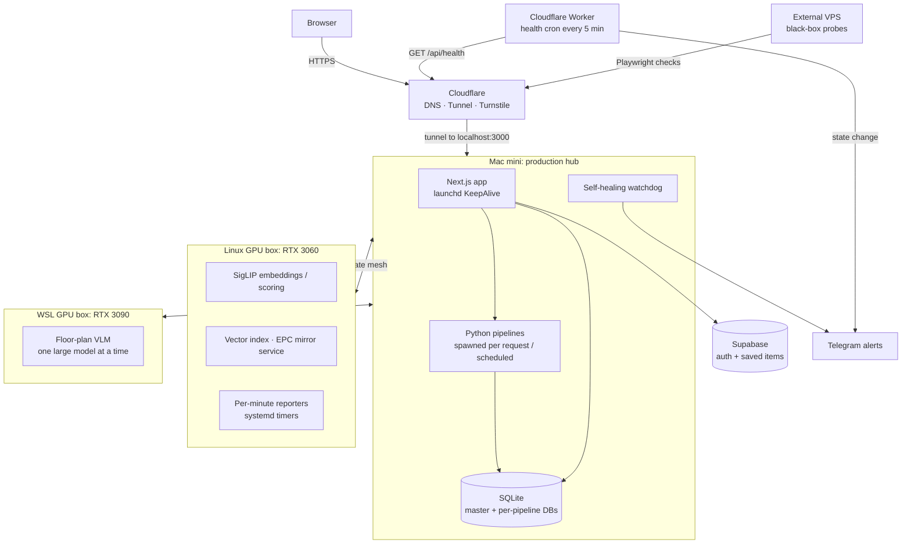

# Architecture

wheretolive.xyz is run by one engineer on a small fleet of machines. The design goal has been
**few moving parts, observable workers, and idempotent jobs**, not "cloud-native at any cost".
This page describes the production system as of September 2026. Numbers carry the date they
were measured.

## Hosts

| Host | Role | Scheduler |
|---|---|---|
| Mac mini | Serves every user request, owns all state (SQLite), runs pipelines, dispatchers and the watchdog | launchd (79 job definitions tracked in the private repo, 2026-09-29) |
| Linux GPU box (RTX 3060, 12 GB) | Embeddings, image scoring, vector search, EPC mirror service | systemd user units + timers (31 unit files tracked, 2026-09-29) |
| WSL GPU box (RTX 3090) | Floor-plan vision-language model | systemd |
| External VPS | Black-box checks of the public site from outside the home network | systemd timer |
| Cloudflare | DNS, tunnel ingress, captcha, edge health Worker | Worker cron |

## Design decisions

**Interactive work on the Mac, GPU and batch work on the Linux boxes.**
Anything that must answer a user request within seconds (page render, postcode evaluation,
retrieval) runs on the Mac. GPU-bound or storage-heavy work (embeddings, VLM, large image caches)
runs on the Linux boxes. The rule is "interactive vs cron", so a GPU box going offline delays
background work but never breaks a page.

**The Mac is the single source of truth.**
Satellites never own state that the site reads directly. They pull work from the Mac and push
results back. Stats flow through a simple **reporter pattern**: each worker POSTs a JSON snapshot
to an admin endpoint every minute, the Mac stores the latest one, and the admin UI renders it.
There is no queue or message bus. Snapshots are latest-wins, so a lost report costs nothing.
See [`gpu-pipeline/`](gpu-pipeline/).

**Child processes, not microservices.**
The Next.js API layer is thin. Anything CPU-bound or multi-step runs as a Python process, and its
stdout is streamed back to the browser as Server-Sent Events, so the user sees per-dimension
progress within about a second. Each script can be debugged with `python3 script.py …`. The cost
is a 1–2 s cold start per request, which is acceptable at this traffic level.

**SQLite, split by write pattern.**
A read-heavy master DB serves the site. Write-heavy pipelines (sales history, job queues, images)
live in separate DB files so they don't contend for the master's write lock. Every connection
goes through one helper that sets WAL mode, `busy_timeout` and the standard PRAGMAs. Long nightly
steps are serialised to avoid WAL contention. One lesson from the logs (2026-05-07): wrapping an
indexed column in `ABS()` made the planner scan instead of seek. An admin query scanned ~1.2 B
rows and took the site down. Rewriting it as `BETWEEN ? AND ?` bounds gave an 84× speedup. Admin
queries are now benchmarked before merge.

**Idempotent, watermark-driven pipelines.**
Backfills and pushes between hosts use watermarks and `INSERT OR IGNORE`. Upserts use
`ON CONFLICT DO UPDATE … COALESCE`, so a partial refresh can never wipe fields that an earlier
enrichment step filled in. Any job can be re-run safely after a crash.

**Streaming through the tunnel.**
The Cloudflare tunnel drops idle connections after about 100 s, so every slow endpoint (LLM
chat, VLM analysis) streams SSE heartbeats.

**Deploys are boring on purpose.**
Build, then `launchctl kickstart -k` the server. The tunnel survives the restart, and each build
gets a unique ID so no page references deleted chunks. Deploys are main-only and every deploy is
tagged; the rollback script checks out a chosen `deploy-*` tag, rebuilds and restarts. See
[`ops/deploy/`](ops/deploy/).

**Trust-first data.**
Public numbers are zero-tolerance: show "insufficient data" rather than a guess. The assistant's
tools carry the same rule (thin-sample guards, coverage notes). See [`agent/`](agent/).

## Observability and recovery

Layers, from inside out:

1. **In-host checks and reporters.** Heartbeats, queue probes, WAL checkpoints, backup freshness,
   GPU health. Details in [`ops/monitoring/`](ops/monitoring/).
2. **Self-healing watchdog.** Restarts a known allow-list of jobs and verifies recovery on the
   next tick before calling it fixed. Details in [`ops/watchdog/`](ops/watchdog/).
3. **External black-box probes** from a VPS outside the home network: status, meta tags, console
   errors, auth gates, Lighthouse.
4. **Edge health Worker** on Cloudflare cron: alerts only on up↔down transitions, de-duplicated
   in KV, so it still fires if the whole home network is down.

## Known limits

- **Single operator, single production host.** The Mac is a single point of failure. That is
  acceptable for a personal product and would be the first thing to change with a team or real
  revenue.
- **No CI/CD for the private codebase.** Tests run locally before deploy. This public extract
  runs its offline tests and a secret scan in GitHub Actions.
- **Data licensing** limits what can be published. This repository contains code only, no data.
