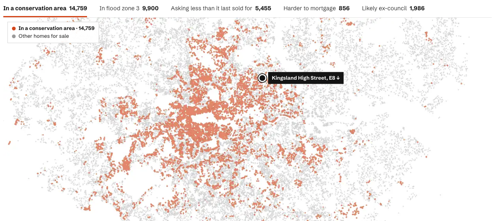
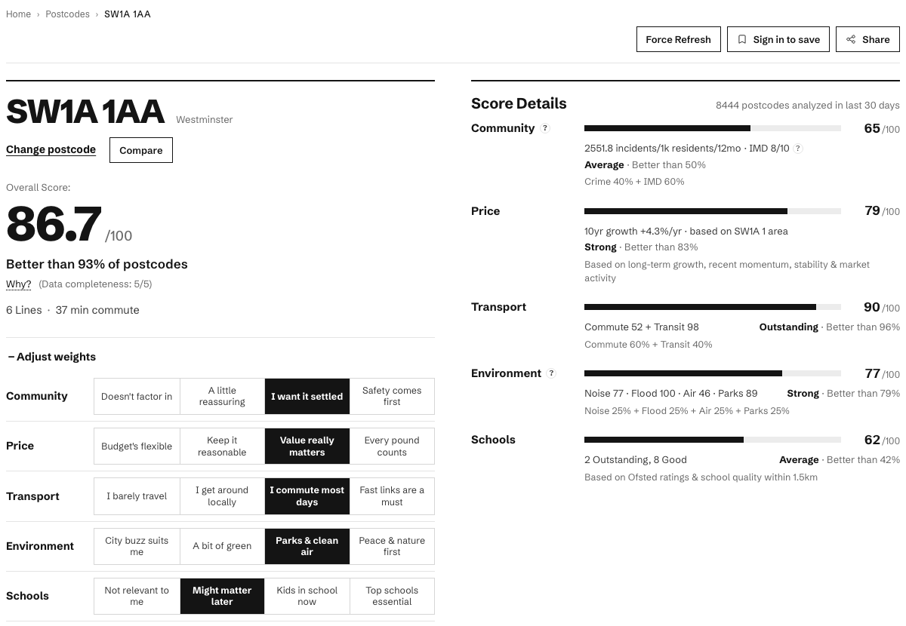

# wheretolive — engineering

Engineering behind **[wheretolive.xyz](https://wheretolive.xyz)**, a London property and
neighbourhood intelligence site that I build and run on my own. It checks a listing or a postcode
against the public record: sold prices, energy certificates, schools, crime, transport, flood risk,
planning and more. A bilingual (EN/ZH) LLM assistant answers questions using tools over the same
data.

This repository is a **curated, sanitised extract** of the private codebase (about 3.4K commits
from January to September 2026). It covers the parts that show how the system is operated,
evaluated and scaled. Data-ingestion code, data files, auth and admin code are left out on
purpose.



## What's here

| Module | What it shows | Tests |
|---|---|---|
| [`ops/watchdog`](ops/watchdog/) | Self-healing watchdog. It fixes a short allow-list of known failures (a crashed launchd job, a wedged tunnel, a hung remote worker), checks each fix on the next tick, and pages a human only when a fix didn't hold. Has observe/enforce modes, fix budgets and an episode ledger. | 34 |
| [`ops/monitoring`](ops/monitoring/) | Layered monitoring where no detector shares fate with what it watches: in-host checks, a cross-host dead-man's switch, external Playwright/Lighthouse probes and a Cloudflare Worker edge probe. Also backups with freshness checks, SQLite/WAL health, LLM spend alerts and retention. | 57 |
| [`ops/deploy`](ops/deploy/) | Deploy and rollback for a single production host, the launchd scheduling model, and an inventory of the job fleet. | 56 |
| [`gpu-pipeline`](gpu-pipeline/) | Batch ML on two home GPU boxes driven from the Mac. Embedding daemon and SigLIP server under systemd (OOM policy, drop-ins, timers), per-minute reporters, dispatch and reconciliation, a GPU watchdog, and floor-plan VLM analysis on vLLM. | 89 |
| [`agent/tools`](agent/tools/) | The LLM assistant's tool layer: deterministic, read-only SQL tools served over MCP and over OpenAI-style tool calling. Tools return numbers together with the caveats needed to quote them. | 271 |
| [`agent/evals`](agent/evals/) | Six-layer evaluation stack: structural trace assertions, needle probes, an LLM-as-critic benchmark (Claude gold set vs local Qwen baselines, [results](agent/evals/RESULTS.md) including the critic's own blind spots), a behaviour contract suite and a weekly audit. | 49 |
| [`scoring`](scoring/) | Postcode scoring engine. Five dimensions from public data, streamed per dimension, calibrated PCHIP → percentile → N(65, 15) so scores stay comparable across versions. | 124 |
| [`ml`](ml/) | Experiment logs. Valuation models (kNN → GBR, with a target leak caught and withdrawn, and temporal walk-forward validation) and floor-plan orientation (pre-registered, double-blind evaluation). | 36 |

**Where to start:** for SRE and infrastructure, read [`ops/watchdog`](ops/watchdog/) and
[ARCHITECTURE.md](ARCHITECTURE.md). For LLM evaluation, read [`agent/evals`](agent/evals/) and its
[RESULTS.md](agent/evals/RESULTS.md).

## Architecture in one paragraph

A Mac mini serves every user request and owns all state in SQLite. Two GPU boxes (an RTX 3060
under Linux and an RTX 3090 under WSL) run embeddings, image scoring and a floor-plan VLM. They
pull work from the Mac and push results and per-minute stats back over a private mesh. Cloudflare
Tunnel is the only ingress. Around 80 launchd jobs and 30 systemd units run the schedules. A
self-healing watchdog, external black-box probes and an edge health Worker cover failures from
inside and outside the network. Full write-up: **[ARCHITECTURE.md](ARCHITECTURE.md)**.



## By the numbers (private repo snapshot, 2026-09-29)

| | |
|---|---|
| Commits | 3,385 (Jan–Sep 2026) |
| launchd job definitions | 79 |
| systemd unit files (GPU boxes, monitor) | 31 |
| Python test files · web test files | 336 · 188 |
| Hosts | Mac mini (prod) · Linux RTX 3060 · WSL RTX 3090 · external VPS · Cloudflare |

## How it was built

One engineer, working with AI coding agents (Claude Code) for implementation. I own the product,
the architecture, the operations and the evaluation loop. The design specs, plans and tests in
the private repo come out of that workflow.

## Running the tests

Each module is self-contained and has its own `README.md` and tests. They run offline, with no
network, no production database and no secrets:

```bash
cd <module> && python -m pytest -q
```

CI runs every module's tests plus a [gitleaks](https://github.com/gitleaks/gitleaks) secret scan
on each push.

## Licence

All rights reserved. Published for review; see [LICENSE](LICENSE).
