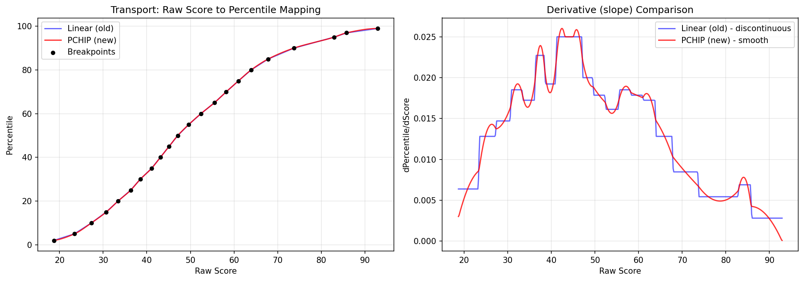
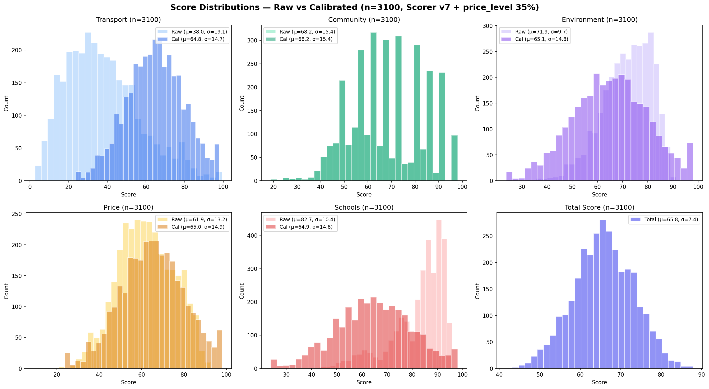

# Scoring method

How `simple_scorer.SimpleScorer` (scorer version 9, `cache/config.py`) turns the raw
data collected by the evaluators into five calibrated dimension scores and a total.
Everything here is read off the code; where a number comes from a code comment it
says so and gives the date recorded there.

## 1. Two layers

```
evaluate_single.py  (CLI; the site runs it as  <postcode> --free --json --stream)
 ├─ HomeEvaluator (evaluator.py)            ── legacy "collector" layer
 │    ├─ LocationConvenienceEvaluator       commute (TfL / Google Routes), transit, long-distance
 │    ├─ SurroundingEnvironmentEvaluator    street crime (data.police.uk)
 │    └─ EconomicFactorsEvaluator           Land Registry price analysis
 ├─ AreaDemographicsEvaluator  ┐
 ├─ SchoolEvaluator            │  run in parallel threads, each streamed
 ├─ noise / flood / air / parks│  as soon as it finishes
 └─ hub commute (5 hubs)       ┘
        │  raw data only
        ▼
 SimpleScorer.calculate_scores()  ── the published score (5 dimensions + total)
```

The legacy layer also computes its own weighted "category" scores (location 40% /
environment 25% / economic 35%). Several of its sub-scores are placeholder
heuristics driven by default inputs (shopping, medical, dining, cleanliness...), and
that score is only printed in the plain-text CLI report. The JSON output — what the
site shows — uses only the raw data those evaluators attach to `property_data`
(`_api_commute_time_minutes`, `_api_transit_data`, `_api_crime_data`, ...) and
rescores it with `SimpleScorer`.

## 2. Raw dimension scores (0–100)

| Dimension | Weight | Raw formula |
|---|---|---|
| transport | 20% | commute 60% + transit 40% (renormalised if one is missing) |
| community | 25% | crime 40% + IMD 60% (renormalised if one is missing; `None` if both are) |
| environment | 20% | noise, flood, air, parks at 25% each; missing parts drop out and the rest are reweighted |
| price | 25% | price level 35%, long-term growth 30%, momentum 20%, stability 10%, activity 5% |
| schools | 10% | the `SchoolEvaluator` score as is |

**Commute.** Minutes are turned into "shorter than X% of London commuters" using a
hard-coded commute-time CDF (source per the code comment: Census 2011 + TfL *Travel in
London* report 16). Two signals are blended (the "Option B" comment, recalibrated
2026-06-10):
- A (40%): point-to-point TfL journey, next weekday 09:00, to the configured
  destination (`commute_config.json` / `--destination`);
- B (60%): the postcode *sector*'s weighted average journey time to 20 employment hubs
  (weights 3/2/1 by hub size), read from a precomputed `sector_hub_commute` table.
  The builder for that table is not part of this module; without it, commute = A only.

**Transit.** The rail-station ("tube") score from the TfL path of
`TransitConvenienceEvaluator` — see [transit.md](transit.md).

**Crime (v9).** London percentile of the neighbourhood's residential crime rate per
1,000 residents (police.uk street crime over the trailing 12 months, Census 2021
population denominators), read from an offline `area_intel.db`: `crime = clamp(100 − pctile, 2, 98)`.
The code comment dates this to 2026-07-09 and records that the previous signal (crime
count around the point from the live API, divided by an assumed daytime population per
area type) had a Spearman correlation of only 0.544 with the true neighbourhood rate —
commercial postcodes were over-penalised and small-population LSOAs missed. The old
path is still the fallback outside London or when the offline DB has no row. If the
local police force does not publish to data.police.uk, a count of 0 is treated as
"unknown", not "safe", and the crime part is skipped.

**IMD.** English Indices of Deprivation 2025 decile of the LSOA (postcodes.io gives
the LSOA21 code): decile 1 → 10 points … decile 10 → 100 points.

**Environment.**
- Noise: DEFRA strategic noise maps (Round 4, Lden) for road, rail and airport, combined
  as an energy sum `10·log10(Σ10^(L/10))`, scored by a logistic curve centred on 63 dB.
- Flood: Environment Agency NaFRA2 rivers & sea and surface water; the higher band
  wins (very low 100, low 75, medium 50, high 20). A refused or failed WMS call returns
  `None` and is *not* cached: until 2026-09-27 such failures were cached as "very low"
  (see `tests/test_flood_wms_errors.py`).
- Air: nearest LondonAir (LAQN) site within 5 km, 2023 annual means of NO₂/PM2.5/PM10
  as a ratio of the WHO 2021 guideline values, mapped through a sigmoid.
- Parks: OS Open Greenspace public-access polygons for Greater London; distance to the
  nearest *edge*, each park weighted by √area and by distance, `score = 100·(1 − e^(−eff/6))`.
  Outside London it falls back to an OpenStreetMap Overpass count.

**Price.** From HM Land Registry price-paid data for the unit postcode, widened to the
sector and then the outcode (local `lr_transactions` table) when there are fewer than 8
residential market sales. Price level is a logistic of `avg_price / £550k`; growth uses
repeat sales of the same address (holding period ≥ 3 months, holding-period-weighted
CAGR over 10/5/3 years); stability is a sigmoid on the standard deviation of *all*
repeat-sale returns (neutral 50 below 5 pairs); activity is a sigmoid on the pair count.
A 2026-07-08 comment explains why the stability curve is centred on std = 10: the earlier
version was tuned on the ≤ 5-row display sample, which is biased.

**Schools.** GIAS + Ofsted within 1.5 km, exponentially distance-weighted: average
rating 40%, Outstanding (and Good) schools within 1 km 30%, primary/secondary choice
10%, avoiding Requires Improvement/Inadequate 20%. No rated school nearby → 40.

## 3. Calibration: raw → percentile → N(65, 15)

Raw scales are not comparable: in the current breakpoints the London median raw score
is 31.6 for transport, 70.2 for environment and 85.6 for schools. A raw "70" means
something different in each dimension, and any formula change moves the whole
distribution.

For each dimension (`_calibrate_score`):
1. `CALIBRATION_BREAKPOINTS[dim]` holds 22 `(raw, percentile)` points (p2 … p99)
   sampled from the population of scored London postcodes.
2. A PCHIP (monotone cubic Hermite) interpolator maps raw → percentile. Outside the
   first/last breakpoint it extrapolates linearly using the end slope; the percentile is
   clamped to [0.001, 0.999].
3. The percentile goes through an inverse normal CDF (Abramowitz & Stegun rational
   approximation, input clamped to [0.0001, 0.9999]) and becomes
   `65 + 15·z`, clamped to [5, 98].

The total is the weighted mean of the *calibrated* dimensions, calibrated once more
with its own `"total"` breakpoints. Without that second pass the averaging of five
partly independent scores shrinks the spread (the code comment puts the SD at ~7.5);
the v7 chart below shows the uncalibrated total at σ = 7.4. The rating text is
`Better than X% of postcodes` with `X = Φ((score − 65)/15)` clamped to [1, 99]; the
`_get_rating` docstring records a 2000-postcode check on 2026-05-07 giving
N(64.39, 15.31) for the total. With fewer than 3 dimensions there is no total.

Why PCHIP rather than straight lines between breakpoints: piecewise-linear
interpolation is continuous but its slope jumps at every breakpoint, so the same raw
improvement is worth abruptly more or fewer points depending on which side of a
breakpoint it falls (right panel below). PCHIP is smooth and, unlike an ordinary cubic
spline, stays monotone between breakpoints, so it cannot overshoot and invert rankings.



*Transport raw → percentile with an older breakpoint set: linear (old) vs PCHIP, and
their slopes.*



*Historical chart (scorer v7, n = 3,100, from the chart title): raw vs calibrated
distributions per dimension. Community shows raw = calibrated because it was not
calibrated then (it is since 2026-04-24), and the total was not yet re-calibrated
(σ 7.4). Both gaps were fixed in later versions.*

**Recalibration.** `recalibrate_all.py` reads every postcode with all six cached
dimensions from `evaluations.db`. Pass 1 computes raw dimension scores with calibration
disabled and samples the 22 percentiles (ties nudged by +0.01 because PCHIP needs
strictly increasing x). Pass 2 applies the new per-dimension breakpoints, computes the
weighted averages and samples the `"total"` breakpoints. It prints a dict to paste into
`CALIBRATION_BREAKPOINTS` (the `--apply` flag is declared but not implemented). Per the
code comments, breakpoints were re-derived after the multi-hub commute blend (transport,
2026-06-10, n = 33,616) and the v9 crime change (community, 2026-07-09, n = 44,622). Because the target distribution stays
N(65, 15), a postcode's score keeps the same meaning across scorer versions even when a
formula changes underneath.

## 4. Caching and versioning

- `CACHE_VERSION = f"{DATA_VERSION}.s{SCORER_VERSION}"` is part of every cache key, so
  a new data release or scorer version makes old rows invisible without deleting them.
- Raw data is cached per dimension in SQLite (`cache/repository.py`, one table per
  dimension; commute is keyed by postcode *and* destination; postcode keys are
  normalised so `N17GZ` and `N1 7GZ` are the same row). TTLs from
  `DIMENSION_TTL_DAYS`: commute 7 d, transit 30 d, safety 30 d, demographics 90 d,
  price 90 d, hub commute 7 d, anything else (schools) 30 d.
- Environment caches are keyed by coordinates (nearest row within 0.0005°, a few tens
  of metres): flood 90 d, air quality 365 d, parks 90 d; noise has no TTL. Cached air,
  parks and noise records are re-scored from their stored measurements on read, so a
  curve change applies without refetching. Inside London, parks are always computed
  from the local polygon index.
- A cache hit needs all six core dimensions. On a hit the scores are **recomputed**
  from the cached raw data (the scorer is cheap, pure arithmetic), so scoring changes
  apply to cached postcodes immediately.
- Results with a failed upstream call (`_failed_dims`) are never cached; a legitimate
  "no data" is cached as a `{"_no_data": true}` marker so it is not refetched.

## 5. Failure semantics

- Each dimension fetch runs in its own thread with timeouts (main evaluation 120 s,
  environment 20 s, hub commute 15 s); one slow or failing source never blocks the
  others, and each result is streamed as a JSON line when ready.
- A missing dimension has `percentile: null` and its weight is redistributed; it is
  never silently scored as the median.
- The JSON separates `_failed_dims` (the API call failed or timed out),
  `_no_data_dims` (the API answered, there is nothing there) and `_paused_dims` (a paid
  API hit its monthly quota in `config.json` → `api_limits`).
